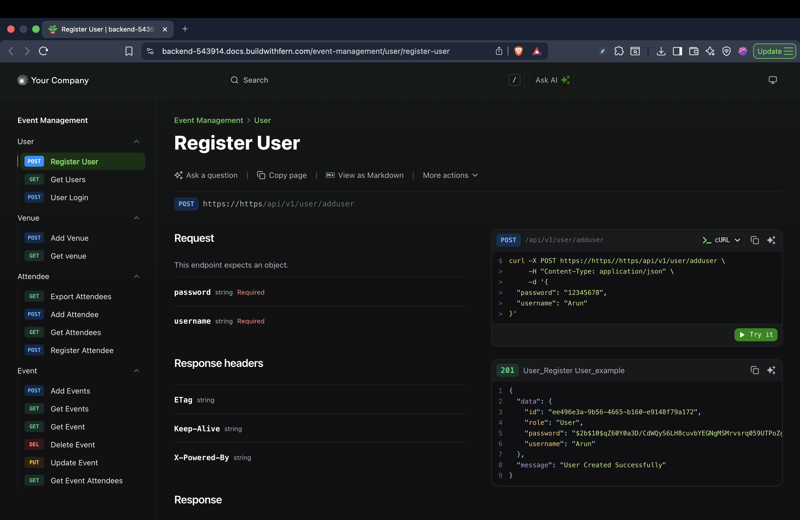

# Event Management API

A secure REST API for managing events, venues, and attendees, built with Node.js, Express.js, Prisma (MySQL), JWT authentication, role-based access, Zod validation, CSV export, and Swagger documentation.

Event Management overview


**Hosted API reference (Fern):** Documentation derived from the Postman collection is published with [Fern](https://buildwithfern.com). Example endpoint page: [Register User](https://backend-543914.docs.buildwithfern.com/event-management/user/register-user).

---

## 🚀 Tech Stack

- **Backend:** Node.js, Express.js
- **Database:** MySQL (Prisma ORM)
- **Authentication:** JWT tokens with role-based access control
- **Validation:** Zod
- **API Documentation:** Swagger (OpenAPI)
- **CSV Export:** Attendee data export
- **Testing & Documentation:** Postman collections

---

## 📌 Features

- User authentication with hashed passwords (using JWT).
- Role-based access control (current role: `"User"`).
- CRUD operations:
  - Users
  - Events
  - Venues
  - Attendees
- Export attendees to CSV.
- Request/response validation using Zod.
- Swagger-based live API documentation.
- Postman request/response collection.

---

## 📊 Database Schema Overview (Prisma)


| Model             | Description                                     |
| ----------------- | ----------------------------------------------- |
| **User**          | Stores login credentials and roles.             |
| **Event**         | Event details linked to a venue.                |
| **Venue**         | Venue details; currently 1-to-1 with Event.     |
| **Attendee**      | Attendee information.                           |
| **EventAttendee** | Many-to-many link between events and attendees. |


> ⚠️ **Note:** Each venue can host only one event currently. Adjust Prisma schema for multi-event support.

---

## 🔐 Authentication & Authorization

- **JWT Tokens** required in the `Authorization` header.
- Role-based middleware protects all critical routes.
- Default role enforcement: `"User"`.

---

## 📑 Major API Routes

### 🛠️ User APIs


| Endpoint     | Method | Auth | Description             |
| ------------ | ------ | ---- | ----------------------- |
| `/adduser`   | POST   | ❌    | Register a new user     |
| `/loginuser` | POST   | ❌    | Login and get JWT token |
| `/getusers`  | GET    | ✅    | Fetch all users         |


### 📅 Event APIs


| Endpoint                  | Method |
| ------------------------- | ------ |
| `/getevents`              | GET    |
| `/eventpage`              | GET    |
| `/bookevent`              | POST   |
| `/updateevent/:id`        | PUT    |
| `/removeevent/:id`        | DELETE |
| `/events/:id/attendee`    | POST   |
| `/getevent/:id/attendees` | GET    |
| `/getevent/:id`           | GET    |


### 📍 Venue APIs


| Endpoint    | Method |
| ----------- | ------ |
| `/getvenue` | GET    |
| `/addvenue` | POST   |


### 🎟️ Attendee APIs


| Endpoint        | Method |
| --------------- | ------ |
| `/getattendees` | GET    |
| `/addattendee`  | POST   |
| `/export`       | GET    |


---

## 📄 API Documentation

- **Fern (Postman → hosted docs):** [Register User](https://backend-543914.docs.buildwithfern.com/event-management/user/register-user) — example from the live reference site deployed from Postman documentation using [Fern](https://buildwithfern.com).
- Swagger Docs:  
Available at `/api-docs` route after starting the server.
- Postman Documentation:  
Request and response examples are saved in the [Postman API Docs](#).  
*([https://backend-1075.postman.co/workspace/Staff_Stud~7ccb60a4-bc9e-472d-b21a-74d4bace8b35/collection/31553102-290d7493-fe6c-46b7-8027-197b5d7d533e?action=share&creator=31553102&active-environment=31553102-53897e6f-c59c-4d66-b78d-65281faa0a63](https://backend-1075.postman.co/workspace/Staff_Stud~7ccb60a4-bc9e-472d-b21a-74d4bace8b35/collection/31553102-290d7493-fe6c-46b7-8027-197b5d7d533e?action=share&creator=31553102&active-environment=31553102-53897e6f-c59c-4d66-b78d-65281faa0a63))*

---

## ⚙️ Setup Instructions

1. **Clone Repository**
  ```bash
   git clone https://github.com/Hselit/event_management_apis.git
   cd event_management_apis
  ```
